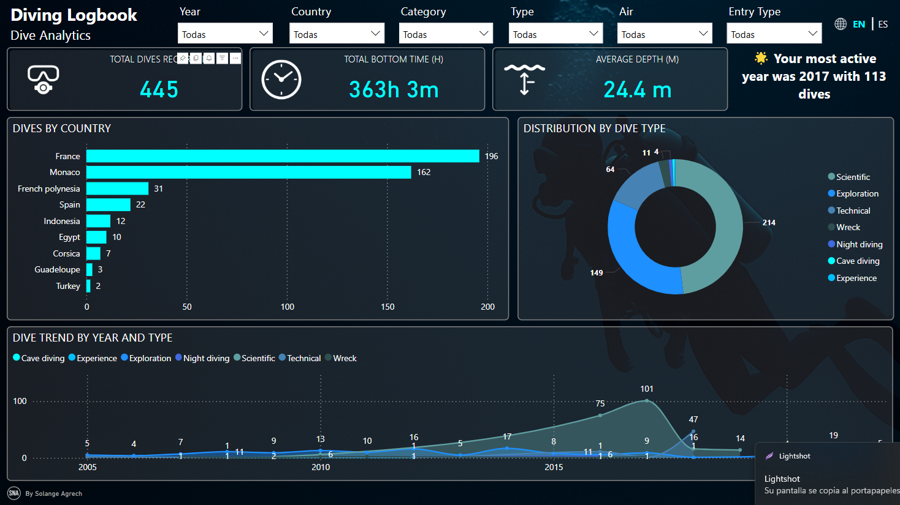

# 🎯 DDD – LevelUp Portfolio

Hi! I'm Solange Agrech, a data analyst focused on transforming data into decisions through interactive visualizations.

---

## 📊 Diving Logbook 

🔗 [View Interactive Dashboard]([https://app.powerbi.com/view?r=TU_LINK_AQUI](https://app.powerbi.com/reportEmbed?reportId=1f8d42ba-9884-4e39-a0e9-d03cc09a8b77&autoAuth=true&ctid=2e13e30b-c57a-4907-870f-4a703ed6dbc4)) 

> Dashboard built in Power BI to explore sales trends by category, time, and region. Includes slicers, drill-through, and KPI cards for quick decision-making.

---

## 🛠️ Tools Used

- Power BI Service
- Power Query + DAX
- Data Modeling
- Slicers & Custom Visuals
- Color logic for KPI states

---

## 📫 Contact

📧 solange@deepdatadive.info  
🌐 [LinkedIn](https://linkedin.com/in/solangeagrech)  
💼 [Fiverr](https://fiverr.com/solangeagrech)
